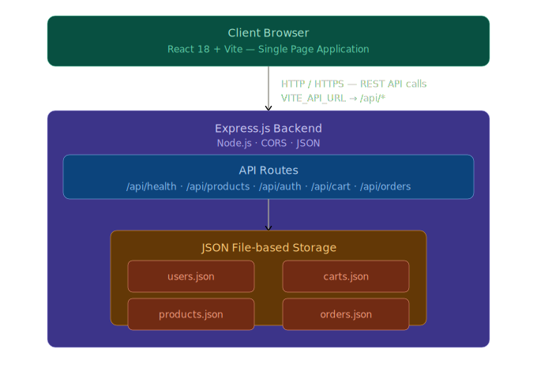

# ShopSmart — E-Commerce Application!!!

A modern, production-ready fullstack e-commerce application built with **React 18** and **Node.js/Express**, using JSON file-based storage. Features a complete CI/CD pipeline, automated testing suite, Docker support, and full AWS cloud deployment on **ECS Fargate**.

## 🚀 Live Demo & Deployments

| Environment       | Platform            | URL                              |
| ----------------- | ------------------- | -------------------------------- |
| Frontend (Static) | GitHub Pages        | Auto-deployed on merge to `main` |
| Full Stack        | Render.com          | Configured via `render.yaml`     |
| Self-hosted       | AWS EC2 + Nginx     | Automated via GitHub Actions     |
| Containers        | AWS ECS Fargate     | Deployed via `aws-pipeline.yml`  |

---

## 🏗️ System Architecture



### Data Flow (Shopping Cart Example)

```
User clicks "Add to Cart"
  → ProductDetail.jsx calls cartApi.add(productId, quantity)
    → api.js fetchApi('/api/cart', { method: 'POST', ... })
      → Express cartRoutes.js reads auth token
        → reads carts.json, appends item
          → writes updated carts.json
            → returns updated cart to client
              → CartContext refreshCart() updates global state
                → Navbar cart badge re-renders with new count
```

### Frontend Architecture

```
client/src/
├── components/            # Shared UI components
│   ├── Navbar.jsx         # Top nav with cart count badge
│   ├── Footer.jsx         # Site footer
│   ├── ProductCard.jsx    # Product listing card
│   ├── CartItem.jsx       # Cart line item
│   ├── ProtectedRoute.jsx # Auth guard — redirects to /login
│   └── ErrorBoundary.jsx  # Catch-all error UI
├── context/               # Global state (React Context API)
│   ├── AuthContext.jsx    # User session + login/logout/register
│   └── CartContext.jsx    # Cart state + CRUD operations
├── pages/                 # Page-level components
│   ├── Home.jsx           # Landing page + featured products
│   ├── Products.jsx       # Browse + filter + search
│   ├── ProductDetail.jsx  # Single product + add to cart
│   ├── Cart.jsx           # Cart review
│   ├── Checkout.jsx       # Shipping form + place order
│   ├── Orders.jsx         # Order history
│   ├── Login.jsx          # Login form
│   └── Register.jsx       # Registration form
└── services/
    └── api.js             # Centralised fetch wrapper + all API calls
```

---

## 🛠️ Tech Stack

| Layer             | Technology                         | Purpose                                       |
| ----------------- | ---------------------------------- | --------------------------------------------- |
| Frontend          | React 18, React Router v7          | SPA with client-side routing                  |
| Build Tool        | Vite 5                             | Dev server + optimized production bundles     |
| Styling           | Custom CSS (36KB) + Tailwind CSS 4 | Dark theme, glassmorphism, animations         |
| Backend           | Node.js 20, Express.js 4           | REST API server                               |
| Auth              | Simple token (`token_<id>_<ts>`)   | Session management without library dependency |
| Storage           | JSON flat files                    | Zero-setup data persistence                   |
| Unit Tests        | Vitest (client), Jest (server)     | Component and route testing                   |
| Integration Tests | Supertest + Jest                   | Real HTTP + real file I/O                     |
| E2E Tests         | Playwright                         | Full browser user flow tests                  |
| CI/CD             | GitHub Actions                     | Auto test + provision + deploy on push        |
| Containers        | Docker (multi-stage) + Compose     | Reproducible local and production environment |
| Registry          | AWS ECR                            | Private container image registry              |
| Compute (ECS)     | AWS ECS Fargate                    | Serverless container execution                |
| Infrastructure    | Terraform 1.7                      | Infrastructure as Code — all AWS resources    |
| Object Storage    | AWS S3                             | Versioned, encrypted app data + TF state      |

---

## 🚦 Getting Started

### Prerequisites

- Node.js 18+ (`node --version`)
- npm 8+ (`npm --version`)
- Docker + Docker Compose (optional, for containerised setup)

---

### ⚡ Quick Start (Recommended)

```bash
# 1. Clone
git clone https://github.com/<your-username>/FullStack-E-Commerce.git
cd FullStack-E-Commerce

# 2. Setup env files
cp server/.env.example server/.env
cp client/.env.example client/.env.local

# 3. Run everything
chmod +x run.sh && ./run.sh
```

App runs at: **http://localhost:5173** (Backend: http://localhost:5001)

---

### 🐳 Docker Setup

```bash
# Build and start both services
docker compose up --build

# Access
# Frontend: http://localhost
# Backend:  http://localhost:5001/api/health

# Stop
docker compose down

# Persistent data is saved in a Docker volume (server-data)
```

---

### 🔧 Manual Setup

```bash
# Install all dependencies
npm install            # root (playwright runner)
cd server && npm install
cd ../client && npm install

# Start backend (Terminal 1)
cd server && npm run dev        # http://localhost:5001

# Start frontend (Terminal 2)
cd client && npm run dev        # http://localhost:5173
```

---

### Demo Account

| Field    | Value                |
| -------- | -------------------- |
| Email    | `demo@shopsmart.com` |
| Password | `demo123`            |

---

## 🧪 Testing Strategy

The project uses a three-layer testing approach:

```
E2E Tests (Playwright)
  └── Full browser flows: auth, cart, checkout, products
      Tests from the user's perspective, hitting the real running app

Integration Tests (Jest + Supertest)
  └── Real Express app + real JSON file I/O
      Covers: auth, cart, orders, products routes
      Tests API contract and data persistence

Unit Tests (Vitest + Jest)
  └── Isolated component/function tests with mocks
      Client: components, contexts, API service
      Server: route handlers with mocked dataUtils
```

### Running Tests

```bash
# ─── Server ───────────────────────────────────────────────────────
cd server

npm test                  # All server tests
npm run test:unit         # Unit only
npm run test:integration  # Integration only (sequential)
npm run test:coverage     # With coverage report

# ─── Client ───────────────────────────────────────────────────────
cd client

npm test                  # All client tests (Vitest)
npm run test:watch        # Watch mode

# ─── E2E (from project root) ──────────────────────────────────────
# Ensure both dev servers are running first, then:
npm run test:e2e

# ─── All at once ──────────────────────────────────────────────────
npm run test:all
```

---

## ☁️ AWS Cloud Pipeline

### Overview

The `aws-pipeline.yml` GitHub Actions workflow implements a **fully automated, zero-touch** deployment pipeline across four sequential phases.

```
Push / PR to main
      ↓
Phase 1 — Tests (server + client in parallel)
      ↓
Phase 2 — Terraform Apply (S3, ECR, ECS)
      ↓
Phase 3 — Docker Build → ECR Push → ECS Fargate Deploy
```

### GitHub Secrets Required

Configure these in **Settings → Secrets and Variables → Actions**:

| Secret                  | Description                                     |
| ----------------------- | ----------------------------------------------- |
| `AWS_ACCESS_KEY_ID`     | AWS Academy lab access key ID                   |
| `AWS_SECRET_ACCESS_KEY` | AWS Academy lab secret access key               |
| `AWS_SESSION_TOKEN`     | AWS Academy session token (refreshed each lab)  |
| `AWS_REGION`            | Target region (e.g. `us-east-1`)                |

### Phase 1 — Testing

Both server and client test jobs run **in parallel**. The pipeline fails fast if any test fails before touching AWS resources.

- **Server**: Jest unit + integration tests, reports uploaded as artifacts
- **Client**: Vitest unit tests, reports uploaded as artifacts
- Test report artifacts are retained for **14 days**

### Phase 2 — Infrastructure Provisioning (Terraform)

All AWS infrastructure is managed as code under `terraform/`. The pipeline:

1. Bootstraps the Terraform state S3 bucket (idempotent — safe to re-run)
2. Runs `terraform init` with the S3 backend injected via `-backend-config`
3. Runs `terraform validate` → `terraform plan` → `terraform apply`

**Resources provisioned:**

| Resource              | Configuration                                                |
| --------------------- | ------------------------------------------------------------ |
| S3 Bucket             | Unique name, versioning enabled, AES-256 encryption, all public access blocked |
| ECR (×2)              | `shopsmart-server` + `shopsmart-client`, scan on push, lifecycle policy (max 10 images) |
| ECS Cluster           | Fargate + Fargate Spot capacity providers, Container Insights |
| ECS Task Definitions  | Server (port 5001) + Client (port 8080), healthchecks, CloudWatch logs |
| ECS Services          | 1 desired task each, awsvpc networking, public IP assigned   |
| Security Groups       | ECS (ports 5001, 8080)                                      |
| CloudWatch Log Group  | `/ecs/shopsmart`, 7-day retention                            |

> **AWS Academy note:** All IAM roles reference the pre-existing `LabRole` — no new IAM roles or policies are created.

### Phase 3 — Container Build & ECS Deployment

1. Authenticates Docker to ECR using the `aws-actions/amazon-ecr-login` action
2. Builds both images using the multi-stage Dockerfiles
3. Pushes images tagged with both `latest` and the commit SHA
4. Registers new ECS task definition revisions with the SHA-tagged image
5. Calls `aws ecs update-service --force-new-deployment`
6. Waits with `aws ecs wait services-stable` until all tasks are healthy

**Dockerfile requirements satisfied:**

| Requirement        | Implementation                                         |
| ------------------ | ------------------------------------------------------ |
| Multi-stage build  | `deps` + `runtime` stages (server), `builder` + `runtime` (client) |
| Non-root user      | Server: `appuser` (UID 1000); Client: `nginx` (UID 101) |
| Healthcheck        | `HEALTHCHECK` instruction on both images               |

## ⚙️ Legacy CI/CD Workflows

| Workflow                | Trigger                  | Purpose                                                              |
| ----------------------- | ------------------------ | -------------------------------------------------------------------- |
| `aws-pipeline.yml`      | push + PR to main        | **Full AWS pipeline** — test → terraform → ECS                      |
| `frontend-tests.yml`    | push + PR to main        | Lint → Format → Vitest → Playwright → Build                          |
| `integration.yml`       | push + PR to main        | Node 18/20/22 matrix: lint, test, build                             |
| `ci.yml`                | push + PR (all branches) | Full CI: client + server build, test, format                         |
| `deploy.yml`            | push to main             | SSH → EC2: git pull, npm ci, PM2 restart, Nginx reload              |
| `gh-pages.yml`          | push to main             | Build Vite → deploy to GitHub Pages                                  |
| `server_matrix.yml`     | manual                   | Node version compatibility check                                     |
| `variables_secrets.yml` | manual                   | Demo: env variables and artifact management                          |
| `recap.yml`             | manual                   | Demo: basic workflow concepts                                        |

---

## 📁 Infrastructure File Layout

```
FullStack-E-Commerce/
├── terraform/
│   ├── main.tf             # Provider config + S3 backend (runtime-configured)
│   ├── variables.tf        # All tunable variables with defaults
│   ├── data.tf             # Default VPC, subnets, LabRole data sources
│   ├── s3.tf               # App data S3 bucket (versioned, encrypted, private)
│   ├── ecr.tf              # ECR repos + lifecycle policies
│   ├── security_groups.tf  # ECS security groups
│   ├── ecs.tf              # ECS cluster, task defs, services
│   └── outputs.tf          # All resource URLs/names exported
├── server/
│   └── Dockerfile          # Multi-stage: deps → runtime (non-root appuser)
└── client/
    ├── Dockerfile           # Multi-stage: builder → nginx runtime (non-root)
    └── nginx.conf           # SPA config on port 8080
```

---

## 📡 API Reference

### Authentication

| Method | Endpoint             | Auth | Description           |
| ------ | -------------------- | ---- | --------------------- |
| POST   | `/api/auth/register` | —    | Register new user     |
| POST   | `/api/auth/login`    | —    | Login → returns token |
| GET    | `/api/auth/me`       | ✅   | Get current user      |

### Products

| Method | Endpoint                   | Auth | Description                                                 |
| ------ | -------------------------- | ---- | ----------------------------------------------------------- |
| GET    | `/api/products`            | —    | List products (supports `?category=`, `?search=`, `?sort=`) |
| GET    | `/api/products/:id`        | —    | Get single product                                          |
| GET    | `/api/products/categories` | —    | List all categories                                         |
| POST   | `/api/products`            | —    | Create product                                              |
| PUT    | `/api/products/:id`        | —    | Update product                                              |
| DELETE | `/api/products/:id`        | —    | Delete product                                              |

### Cart

| Method | Endpoint               | Auth | Description                          |
| ------ | ---------------------- | ---- | ------------------------------------ |
| GET    | `/api/cart`            | ✅   | Get user's cart                      |
| POST   | `/api/cart`            | ✅   | Add item (`{ productId, quantity }`) |
| PUT    | `/api/cart/:productId` | ✅   | Update quantity                      |
| DELETE | `/api/cart/:productId` | ✅   | Remove item                          |
| DELETE | `/api/cart`            | ✅   | Clear cart                           |

### Orders

| Method | Endpoint          | Auth | Description            |
| ------ | ----------------- | ---- | ---------------------- |
| GET    | `/api/orders`     | ✅   | Get user's orders      |
| GET    | `/api/orders/:id` | ✅   | Get single order       |
| POST   | `/api/orders`     | ✅   | Create order from cart |

### Health

| Method | Endpoint      | Description                           |
| ------ | ------------- | ------------------------------------- |
| GET    | `/api/health` | Returns `{ status: "ok", timestamp }` |

---

## ☁️ AWS EC2 Deployment (Legacy)

### EC2 Scripts (`scripts/`)

| Script                | Purpose                                                    |
| --------------------- | ---------------------------------------------------------- |
| `launch_ec2.sh`       | Idempotent instance launcher — skips existing resources    |
| `safe_ec2_control.sh` | State-aware start/stop — no-ops on already-running/stopped |
| `ec2_health_check.sh` | Polls public IP until app is responding                    |
| `ec2_control.sh`      | Simple start/stop wrapper                                  |

### Initial EC2 Server Setup (one-time)

```bash
# 1. Launch instance (idempotent — safe to re-run)
chmod +x scripts/launch_ec2.sh
./scripts/launch_ec2.sh

# 2. SSH into the instance
ssh -i vockey.pem ec2-user@<PUBLIC_IP>

# 3. On EC2: install dependencies
sudo dnf update -y
curl -fsSL https://rpm.nodesource.com/setup_20.x | sudo bash -
sudo dnf install -y nodejs git nginx
npm install -g pm2

# 4. Clone and configure
git clone https://github.com/<your-username>/FullStack-E-Commerce.git ~/shopsmart
cd ~/shopsmart/server && cp .env.example .env

# 5. Start the backend
cd ~/shopsmart/server
npm ci --omit=dev
pm2 start src/index.js --name shopsmart-backend
pm2 save && pm2 startup

# 6. Build frontend
cd ~/shopsmart/client
npm ci && npm run build
sudo mkdir -p /var/www/shopsmart/client
sudo cp -r dist /var/www/shopsmart/client/

# 7. Configure Nginx (copy nginx.conf contents)
sudo nano /etc/nginx/conf.d/shopsmart.conf
sudo systemctl enable nginx && sudo systemctl start nginx
```

After this initial setup, subsequent deploys happen **automatically** via `deploy.yml` on every push to `main`.

---

## 🧹 Code Quality

```bash
# ─── Client ───
cd client
npm run lint          # ESLint (react, react-hooks, react-refresh plugins)
npm run format:check  # Prettier check
npm run format        # Prettier auto-fix

# ─── Server ───
cd server
npm run lint          # ESLint (eslint:recommended, Node env)
npm run format:check  # Prettier check
npm run format        # Prettier auto-fix
```

Both lint and format checks **fail CI** — there is no `|| true` silencing.

---

## 🐛 Known Limitations & Design Decisions

### Why JSON Files Instead of a Database?

JSON files were chosen for **zero-setup portability**. Every evaluator, contributor, or new developer can clone and run `./run.sh` — no database install, no connection string, no Docker needed just to start. The trade-off is that concurrent writes from multiple server processes are not safe.

### Authentication Tokens

A simple `token_<id>_<timestamp>` format is used instead of JWT to avoid any cryptography library dependency. This means tokens never expire. **For production**, replace with `jsonwebtoken` and `bcrypt`.

### Passwords Stored in Plain Text

⚠️ The current implementation stores passwords as plain text in `users.json`. This is intentional for project-scope simplicity. **Before any real deployment**, add bcrypt:

```bash
cd server && npm install bcrypt
```

Then hash in `authRoutes.js` at registration and compare at login.

---

## 🔒 Security Features Implemented

| Feature                | Implementation                                                  |
| ---------------------- | --------------------------------------------------------------- |
| CORS allowlist         | `ALLOWED_ORIGINS` env var — no wildcard `*`                     |
| Auth middleware        | Token required on all cart/order endpoints                      |
| Nginx security headers | `X-Frame-Options`, `X-Content-Type-Options`, `X-XSS-Protection` |
| Non-root Docker user   | Server: `appuser`; Client: `nginx` (UID 101)                   |
| Multi-stage Docker     | No dev dependencies in production image                        |
| npm ci in CI           | Uses lockfile — reproducible, no supply-chain drift             |
| ECR scan on push       | Vulnerability scanning on every image push                     |
| S3 encryption          | AES-256 SSE on all S3 objects                                  |
| S3 public access block | All four public access block settings enabled                  |

---

## 🎨 Design Features

- **Dark Theme** — Modern dark UI with deep charcoal backgrounds
- **Glassmorphism** — Subtle backdrop-blur effects on cards and modals
- **Smooth Animations** — CSS transitions on hover, cart add, and page changes
- **Mobile-first** — Responsive grid layout that collapses cleanly on small screens
- **Premium Typography** — Google Fonts Inter + Outfit

---

## 📝 License

MIT License — see [LICENSE](LICENSE) for details.
